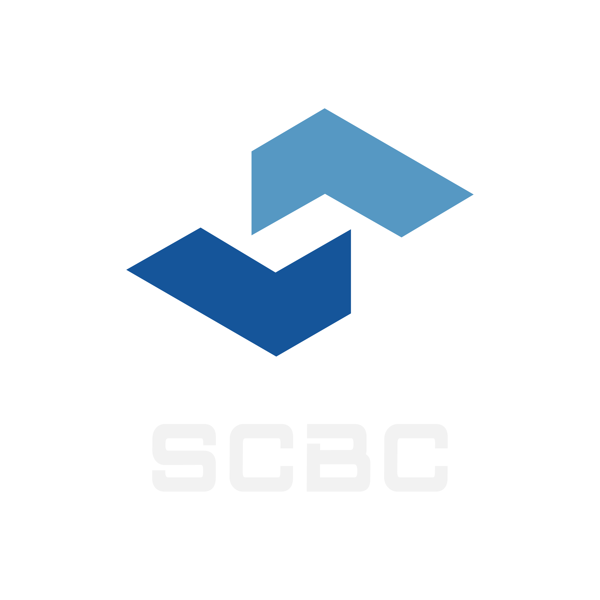

**Science BC: 一个开放的中文区块链交流社区**

---

  <a href="https://www.zhihu.com/people/lin-wei-8-2">知乎</a> •
  <a href="">公众号</a>

## About **Science BC**
> **Science BC**全称**Science block-community**，是面向区块链科研人员及爱好者的平台，致力于国内外区块链方向优秀科研工作的传播和科学普及。社群始于2021年，于当时感受到国内区块链领域**学习资料匮乏**、**学习路线模糊**、**公开的学术资源少且分散**，**缺乏良好的本领域科研引导和研究视野**，作为区块链方向的硕博研究生，我们发起了社区。社区在一次次交流探讨和公益分享逐渐壮大，并组织了很多有趣且有深度的分享活动。在社群往期的活动中，我们邀请了国内外在读或毕业的众多优秀的相关领域的硕博生和老师进行区块链领域的分享。社群在国内邀请的分享嘉宾分布于清华、北大、中科院、浙大、港城、港浸会、港理工、人大、北邮、电科大、西交利物浦等高校和研究单位，国外嘉宾分布于MIT、CMU、ICL、UBC、Berkeley、NUS、NTNU、UofG等知名高校。此外我们还邀请了**MoveBit**的联合创始人卢毅老师、**某大厂**区块链团队进行分享，也和**浙大链协**共同策划过分享活动。未来，我们将会支持**Web3青年学者计划**，进行更多的学术型分享；也会与更多高校的链协、组织合作，策划更多的分享活动提供给大家。

## 📇Table of Content
- [📇Table of Contents](#📇table-of-contents)
- [🔔News](#🔔News)
- [📖Community Resources](#📖Community-Resources)
- [👨‍🎓Member Links](#👨‍🎓Member-Links)
- [🔗Related Resources](#🔗Related-Resources)

## 🔔News
- **上传江山老师分享PPT，涉及对区块链各方面的杂谈分享，内容详解可参考[本文](https://www.zhihu.com/question/422311303/answer/2214832435)**
- **上传路远老师分享PPT，涉及对小飞象系列共识算法的讲解，内容详解可参考[本文](https://zhuanlan.zhihu.com/p/459025656)**
- **上传Chaochen_Shi面向智能合约的代码智能技术分享PPT**
- **上传深入浅出零知识证明分享PPT**
- **上传BlockSec对Web3观点分享PDF**
- **上传BlindHub一作XianruiQin的论文分享PPT**

## 📖Community Resources
- 江山老师分享PPT，涉及对区块链各方面的杂谈分享，内容详解可参考[本文](https://www.zhihu.com/question/422311303/answer/2214832435)
- 路远老师分享PPT，涉及对小飞象系列共识算法的讲解，内容详解可参考[本文](https://zhuanlan.zhihu.com/p/459025656)
- Chaochen_Shi面向智能合约的代码智能技术分享PPT
- 深入浅出零知识证明分享PPT
- BlockSec对Web3观点分享PDF
- BlindHub一作XianruiQin的论文分享PPT

## 👨‍🎓Member Links
- 社群贺博士整理的与智能合约相关的会议和文章，详情点击[链接](https://github.com/hzysvilla/Academic_Smart_Contract_Papers)

## 🔗Related Resources
-  区块链中文资源汇总[资源](https://github.com/LiuBoyu/blockchain)
-  区块链中文技术开发文档资料[资源](https://github.com/chaozh/awesome-blockchain-cn)
-  区块链学术论文参考[列表](https://github.com/decrypto-org/blockchain-papers)
-  区块链学习路径[参考](https://github.com/protofire/blockchain-learning-path)
